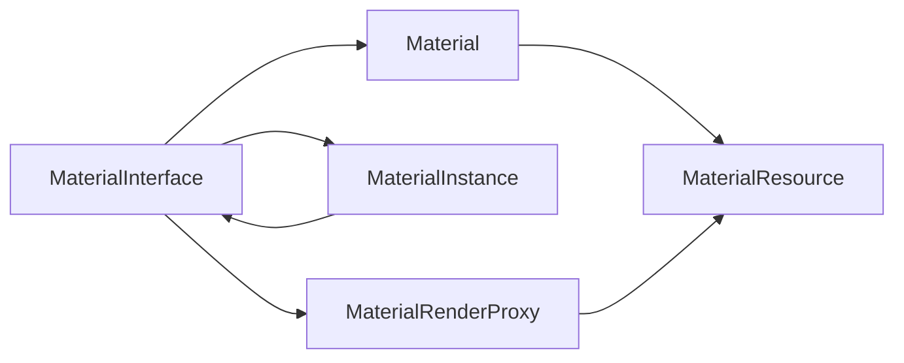

# AshEngine 材质系统设计（V1）

**状态：** 提议  
**日期：** 2026-04-21  
**范围：** `project/src/engine/Function/Asset`、`project/src/engine/Function/Scene`、`project/src/engine/Function/Render` 以及相关设计文档

## 1. 目标

为 AshEngine 建立第一版正式材质系统，使 Editor、Sandbox 以及未来 Client 的上层调用都只需要关注：

- 往 `Scene` 中添加对象
- 给对象挂 `MeshComponent`
- 为 mesh section 指定 `MaterialInterface`
- 修改材质实例参数

上层不应再需要理解底层 renderer、graphics program、draw submit、`render_visible_frame()` 等渲染细节。

本设计参考 UE 5.7 的材质分层思路，但不照搬 UE 的完整复杂度。V1 采用 **UE-lite** 方案：

- 先建立稳定对象边界：`MaterialInterface`、`Material`、`MaterialInstance`、`MaterialRenderProxy`、`MaterialResource`
- 底层先只落地固定 PBR `Surface` 材质
- `MaterialDomain`、`BlendMode`、`ShadingModel` 等枚举从第一版开始正式存在
- `Decal / PostProcess / UI / Transparent` 等能力先预留接口，不在 V1 完整实现

## 2. 当前现状与问题

当前 AshEngine 还没有真正的材质系统。

### 2.1 当前已有能力

- `project/src/engine/Function/Asset/AssetData.*` 维护纯 CPU 侧 `Model` / `Mesh` / `MaterialSlot` 数据
- 模型导入会把原始材质信息保存在 `Model.material_slots`
- `MeshSection.material_slot` 只是一个索引
- `AssetDatabase` 已经识别 `AssetType::Material`，并支持 `.mat` / `.material` 后缀分类
- `RenderAssetManager` 当前只管理 static mesh render asset
- `SceneRenderer` 当前只使用 `StaticMeshRenderSection.base_color_factor`

### 2.2 当前缺失能力

- 没有正式 `Material` / `MaterialInstance` 资产类型
- 没有统一的材质参数系统
- 没有 `MeshComponent` 材质覆写能力
- 没有 render-thread 可消费的材质 render proxy / compiled resource
- 没有把导入材质转换为正式运行时材质资产

### 2.3 当前设计问题

当前材质语义直接泄漏在静态网格 section 数据里，表现为：

- `RenderAssetManager` 直接从 `MaterialSlot` 解析 `base_color_factor`
- `SceneRenderer` 直接把 `section.base_color_factor` 当成 draw 常量

这条链路的主要问题是：

- 上层没有正式的材质对象模型
- section 的材质无法按资产管理和复用
- 导入材质信息无法自然过渡到 Editor 可编辑资产
- 渲染线程没有清晰的材质编译产物边界
- 以后加多 view、更多 pass、更多材质域时会继续把临时状态塞进 renderer

## 3. 设计结论摘要

本设计的关键结论如下：

1. V1 采用 **固定 PBR + `MaterialInstance` + section 级材质覆写** 的路线。
2. 材质与贴图都进入正式资产体系，场景和组件只引用资产。
3. 保留 UE 风格的对象骨架：
   - `MaterialInterface`
   - `Material`
   - `MaterialInstance`
   - `MaterialRenderProxy`
   - `MaterialResource`
4. `MaterialDomain`、`BlendMode`、`ShadingModel` 从第一版开始正式进入数据模型。
5. V1 真正落地的运行时能力限定为：
   - `Surface`
   - `Opaque`
   - `Masked`
   - 固定 PBR 参数链
6. `MeshComponent` 支持基于 `material_slot` 的 section 级材质覆写。
7. 渲染线程只消费只读快照和编译产物，per-view 状态与 material 状态彻底分离。

## 4. 参考 UE 5.7 的对标关系

本设计参考 UE 5.7 的材质边界，但有意识地削减到 AshEngine 当前阶段能稳定落地的复杂度。

| UE 5.7 概念 | AshEngine V1 对应物 | V1 说明 |
| --- | --- | --- |
| `UMaterialInterface` | `MaterialInterface` | 上层统一持有接口 |
| `UMaterial` | `Material` | 可编译的基材质定义 |
| `UMaterialInstance` | `MaterialInstance` | 稀疏参数覆写 |
| `FMaterialRenderProxy` | `MaterialRenderProxy` | render-thread draw-time 代理 |
| `FMaterialResource` | `MaterialResource` | 编译产物、只读、可缓存 |
| Material Graph / Expressions | 后续扩展 | V1 不实现材质图 |
| Shader Map / Async Compile | 后续扩展 | V1 不实现完整编译系统 |

因此，AshEngine V1 的核心思路是：

- **学 UE 的边界**
- **不学 UE 第一版不需要的复杂度**

## 5. 总体架构

材质系统建议拆成 4 层。

### 5.1 Authoring / Asset 层

负责可序列化材质数据，只表达“材质是什么”，不暴露 GPU 资源。

这一层负责：

- `MaterialDomain`
- `BlendMode`
- `ShadingModel`
- 参数定义
- 固定 PBR 输入绑定
- 贴图资产引用
- 可序列化 JSON 文件格式

### 5.2 Runtime Material Object 层

负责给 `Scene`、`MeshComponent`、`AssetDatabase`、Editor 属性系统提供稳定运行时对象。

核心对象：

- `MaterialInterface`
- `Material`
- `MaterialInstance`

这一层是 Engine-facing API，不应暴露后端 RHI 或 renderer 细节。

### 5.3 Render Material 层

负责 render-thread 可消费的只读结果。

核心对象：

- `MaterialResource`
- `MaterialRenderProxy`

这一层负责 shader/pipeline/参数布局/pass relevance 等渲染语义，但不承载 per-view 状态。

### 5.4 Scene / Component 集成层

负责把 `Scene` / `Entity` / `MeshComponent` 上的材质引用解析为 render-side 绑定快照。

这一层的关键规则：

- `MeshComponent` 只持有 mesh 引用和材质引用
- `RenderScene` / `SceneProxy` 只持有解析后的最终材质绑定
- `SceneRenderer` 只提交 draw，不定义材质语义

## 6. 核心对象模型

### 6.1 `MaterialInterface`

`MaterialInterface` 是上层统一持有的抽象基类，Editor、Sandbox、Client、Scene、MeshComponent 都只依赖它。

它至少应提供：

- 资产标识和名字
- `MaterialDomain`
- `BlendMode`
- `ShadingModel`
- 参数查询接口
- 获取最终父 `Material`
- 提供供材质系统解析 `MaterialRenderProxy` 所需的稳定标识与版本信息
- 获取 change version

它的职责是屏蔽“当前拿到的是基材质还是实例材质”。

### 6.2 `Material`

`Material` 是基材质，负责定义：

- 静态材质属性
- 参数布局
- 固定 PBR 输入语义绑定
- 编译输入

`Material` 是 render-side `MaterialResource` 的主要来源。

V1 中，`Material` 允许定义：

- `domain`
- `blend_mode`
- `shading_model`
- `two_sided`
- `alpha_cutoff`
- 深度写入 / 深度测试 / 剔除等基础渲染属性
- 参数描述表
- 固定 PBR 输入绑定表

### 6.3 `MaterialInstance`

`MaterialInstance` 引用父 `MaterialInterface`，只保存稀疏参数覆写。

V1 中它允许覆写：

- `Scalar`
- `Vector4`
- `Texture`

V1 中它不允许覆写：

- `domain`
- `blend_mode`
- `shading_model`
- `two_sided`
- 会影响 pass 分类、pipeline key、shader permutation 的静态属性

这样可以避免实例修改后把整套渲染分类和 pipeline 语义搅乱。

### 6.4 `MaterialResource`

`MaterialResource` 是 render-thread 可消费的不可变编译产物，至少包含：

- `domain`
- `blend_mode`
- `shading_model`
- pass relevance
- shader program key
- pipeline state key
- uniform / texture binding layout
- fallback 规则

同一份 `MaterialResource` 可被多个 `MaterialInstance` 共享。

### 6.5 `MaterialRenderProxy`

`MaterialRenderProxy` 是 draw-time 使用的轻量代理，负责把某个具体 `MaterialInterface` 的最终参数解析成可绑定结果。

它回答的是：

- 这次 draw 应该用哪份 `MaterialResource`
- 这份材质的最终参数值是什么
- 需要绑定哪些纹理、sampler、uniform 数据

### 6.6 对象关系



说明：

- `MaterialInstance` 的父对象类型仍然定义为 `MaterialInterface`
- V1 生产内容建议以 `Material` 为根，最多做浅层实例链
- `MaterialResource` 主要由基 `Material` 的静态属性决定
- `MaterialRenderProxy` 负责把实例参数与编译产物组合起来

## 7. 资产模型与序列化格式

### 7.1 文件与资产类型

- `Material` / `MaterialInstance` 均归类为 `AssetType::Material`
- 规范后缀使用 `.material`
- `AssetDatabase` 继续兼容 `.mat`
- 文件格式继续采用 JSON 文本，与当前 `.ashasset` / `.scene` 风格一致

### 7.2 资源引用规则

- 序列化中统一写相对资产路径
- 运行时再解析成 `AssetId`
- 逻辑层不直接暴露底层纹理文件系统路径语义

### 7.3 纹理资产策略

V1 不单独引入新的 `.texture` 文件格式。

当前已有的图片文件本身就是正式 `Texture` 资产，例如：

- `.png`
- `.jpg`
- `.dds`
- `.hdr`

材质侧只保存纹理资产引用，不再继续扩散“导入文件里的原始路径语义”。

### 7.4 参数系统

参数描述统一建议包含：

- `name`
- `type`
- `group`
- `default_value`
- `ui_min`
- `ui_max`
- `semantic`
- `texture_usage`（仅纹理参数）

V1 实现的参数类型：

- `Scalar`
- `Vector4`
- `Texture`

先预留但不完整实现的参数类型：

- `Bool`
- `Int`
- `StaticSwitch`

### 7.5 固定 PBR 输入绑定

V1 虽然没有材质图，但也不应把 PBR 参数语义写死在 `SceneRenderer` 中。

`Material` 应定义一个固定 PBR 语义绑定表，至少覆盖：

- `BaseColorFactor`
- `BaseColorTexture`
- `NormalTexture`
- `Metallic`
- `Roughness`
- `MetallicRoughnessTexture`
- `EmissiveColor`
- `EmissiveTexture`
- `OpacityMask`

这样未来接入材质图时，可以保持 `MaterialInstance`、Scene 集成和 render-side 接口稳定。

### 7.6 建议的序列化示例

`Material`：

```json
{
  "version": 1,
  "class": "Material",
  "name": "M_SurfacePBR",
  "domain": "Surface",
  "blend_mode": "Opaque",
  "shading_model": "DefaultLit",
  "two_sided": false,
  "alpha_cutoff": 0.5,
  "parameters": [
    {
      "name": "BaseColorFactor",
      "type": "Vector4",
      "group": "Surface",
      "default": [1.0, 1.0, 1.0, 1.0]
    },
    {
      "name": "BaseColorTexture",
      "type": "Texture",
      "group": "Surface",
      "texture_usage": "Color"
    },
    {
      "name": "NormalTexture",
      "type": "Texture",
      "group": "Surface",
      "texture_usage": "Normal"
    }
  ],
  "fixed_pbr_surface": {
    "base_color_factor": "BaseColorFactor",
    "base_color_texture": "BaseColorTexture",
    "normal_texture": "NormalTexture",
    "metallic_factor": "Metallic",
    "roughness_factor": "Roughness",
    "metallic_roughness_texture": "MetallicRoughnessTexture",
    "emissive_factor": "EmissiveColor",
    "emissive_texture": "EmissiveTexture",
    "opacity_mask": "OpacityMask"
  }
}
```

`MaterialInstance`：

```json
{
  "version": 1,
  "class": "MaterialInstance",
  "name": "MI_DamagedHelmet_Default",
  "parent": "Engine/Materials/M_SurfacePBR.material",
  "overrides": {
    "BaseColorTexture": "textures/DamagedHelmet_BaseColor.png",
    "NormalTexture": "textures/DamagedHelmet_Normal.png",
    "Metallic": 1.0,
    "Roughness": 1.0
  }
}
```

## 8. Scene / Component 集成

### 8.1 `MeshComponent` 的新职责

`MeshComponent` 仍然是纯 scene/runtime 数据，不持有任何 renderer 对象。

它除了现有字段外，应扩展为“mesh 引用 + 材质覆写容器”。

建议新增字段/概念：

- `material_overrides`

其中 `material_overrides` 建议按 `material_slot` 保存 override 引用，例如：

```cpp
struct MeshMaterialOverride
{
    uint32_t material_slot = k_invalid_material_slot;
    std::string material_path{};
};
```

`MeshComponent` 在 `.scene` / `.ashasset` 序列化时应直接保存这组 override 映射。

设计原则：

- 上层只改 `MeshComponent`
- 不直接操作 renderer
- 材质覆写以内容语义为中心，而不是以 draw 临时状态为中心

### 8.2 覆写粒度

V1 覆写粒度明确为 **section 级**。

但覆写 key 不建议使用“section 当前顺序下标”，而应使用稳定 `material_slot` 或稳定 section material binding key。

原因：

- 导入/cooking 后 section 顺序未来可能变化
- `material_slot` 更接近内容语义
- Editor 更容易显示和维护 slot 级材质映射

### 8.3 最终材质决议顺序

静态网格 section 的最终材质来源按以下顺序决议：

1. `MeshComponent.material_overrides[slot]`
2. mesh/model 的默认材质引用
3. engine 默认兜底材质 `M_DefaultSurface`

### 8.4 `Scene` 到 `RenderScene` 的信息链

当前主链：

- `Scene.extract_visible_mesh_entities()`
- `RenderScene`
- `VisibleRenderFrame`
- `SceneRenderer`

这条链本身可以保留，但要把材质语义从今天的 `section.base_color_factor` 升级为“最终材质绑定快照”。

对于每个 section，最终至少要能解析出：

- geometry range
- material identity
- `MaterialRenderProxy`
- pass relevance 快照

### 8.5 上层调用约束

Editor、Sandbox、未来 Client 的上层调用模型统一为：

1. 创建实体
2. 添加 `MeshComponent`
3. 指定 mesh 资产
4. 指定或覆写 section 材质
5. 修改材质实例参数

上层不应再关心：

- `GraphicsProgram`
- `RenderPass`
- `Renderer`
- `SceneRenderer`
- draw submit 细节

## 9. Render-side 对象与多 View 规则

### 9.1 `MaterialResource` 的职责

`MaterialResource` 是只读编译产物，至少负责：

- shader program key
- pipeline state key
- 静态渲染状态
- pass relevance
- 绑定布局
- 默认 sampler / fallback 规则

它不持有：

- per-view 数据
- 每次 draw 的 object transform
- output/depth attachment

### 9.2 `MaterialRenderProxy` 的职责

`MaterialRenderProxy` 负责把某个具体 `MaterialInterface` 的最终参数视图暴露给渲染线程。

它应指向：

- 一份稳定 `MaterialResource`
- 一份实例化后的参数覆盖视图

这使得：

- 一个基 `Material` 与多个 `MaterialInstance` 可以共享同一份 `MaterialResource`
- 多个 view 也可以共享同一份 `MaterialRenderProxy`

前提是 proxy 对渲染线程表现为只读。

### 9.3 Pass Relevance

材质编译后应提前产出 pass relevance，而不是在 view submit 时临时猜测。

V1 至少建议包含：

- `supports_surface`
- `supports_depth_prepass`
- `supports_base_pass`
- `is_masked`
- `is_transparent`
- `writes_velocity`（预留）
- `domain`

### 9.4 View 状态与 Material 状态拆分

属于 `view` 的状态：

- output target
- depth target
- viewport / scissor
- clear / load action
- camera matrices
- view uniform data

属于 `material` 的状态：

- shader permutation / program
- blend / cull / depth write 等静态状态
- uniform layout
- texture binding layout
- pass relevance
- static compile flags

属于 `primitive/draw` 的状态：

- object transform
- section range
- 最终 `MaterialRenderProxy` 引用

### 9.5 多 View 规则

同一帧多个 view 渲染同一 scene 时：

- 可以共享 `RenderScene` primitive snapshot
- 可以共享 `MaterialResource`
- 可以共享只读 `MaterialRenderProxy`

不能共享：

- output/depth attachments
- view uniform 数据
- 当前 pass 的 command recording 上下文

这条规则与 AshEngine 已完成的 `SceneRenderer` 多 view 方向保持一致：共享只读编译产物，隔离 per-view 提交状态。

## 10. 导入、默认材质生成与资产数据库

### 10.1 `MaterialSlot` 的新定位

当前 `Model.material_slots` 继续保留，但它在新系统中的定位被降级为：

- 导入中间态
- 重导入输入
- 生成正式材质资产的源数据

它不再是 runtime 渲染直接消费的材质模型。

### 10.2 导入阶段的目标产物

对于一个模型导入，最终应产出三类内容：

- 几何资产：model / mesh
- prefab 资产：`.ashasset`
- 材质资产：按 `material_slot` 生成的一组 `MaterialInstance`

推荐默认规则：

- Engine 内置一个基材质 `M_SurfacePBR`
- 每个导入材质槽默认生成一个 `MI_<Model>_<SlotName>.material`
- 这些实例的参数覆写来自导入出的 `MaterialSlot`

### 10.3 mesh / model 默认材质引用

静态网格除了知道 section 对应哪个 `material_slot`，还应知道该 slot 默认对应哪个正式材质资产。

这份默认材质映射应成为 mesh/model 运行时数据的一部分，而不是导入器临时状态。

建议优先建模为：

- `Model.material_slots` 继续保存导入中间态
- 新增一份 `material_slot -> default material asset` 的正式映射
- `MeshSection` 仍通过 `material_slot` 指向该映射

### 10.4 `AssetDatabase` 扩展

`AssetDatabase` 需要补齐材质加载能力：

- `load_material_by_id`
- `load_material_by_path`
- async 版本
- material object cache

对外推荐统一返回：

- `std::shared_ptr<const MaterialInterface>`

从而屏蔽内部“当前是 `Material` 还是 `MaterialInstance`”的差异。

### 10.5 缺失资产回退

V1 必须定义稳定回退语义：

- 材质资产缺失时回退到 `M_DefaultSurface`
- 贴图资产缺失时回退到内置白贴图 / 法线贴图 / 黑贴图
- 材质加载失败不应让 primitive 丢 draw，而应降级渲染并记日志

## 11. 参数更新、热重载与线程同步

### 11.1 所有权边界

- `Material` / `MaterialInstance` 属于逻辑线程与资产系统侧
- `MaterialResource` / `MaterialRenderProxy` 属于渲染侧消费对象
- `MaterialResource` 视为不可变
- `MaterialRenderProxy` 对渲染线程来说表现为只读快照

逻辑线程不应直接改 render proxy 内部状态。

### 11.2 参数变更分类

参数变更分两类：

1. 动态参数变更  
   例如颜色、贴图、金属度、粗糙度等覆写  
   这些变化不改变 pass relevance，不要求整份 `MaterialResource` 重编译

2. 静态属性变更  
   例如 `blend_mode`、`domain`、`two_sided`、`masked`  
   这些变化会影响 pass 分类和 pipeline key，必须视为重建 `MaterialResource`

V1 中，静态属性修改优先限定在 `Material` 上，不让实例自由改。

### 11.3 版本号与脏标记

建议至少维护三层 version：

- `MaterialInterface` asset change version
- `MaterialRenderProxy` resolved version
- scene primitive material binding version

作用分别是：

- 判断资产内容是否变化
- 判断 render-side 快照是否过期
- 判断某个 primitive 当前绑定是否需要刷新

### 11.4 热重载语义

V1 支持资产级热重载，但采用保守语义：

- `.material` 文件被重新保存后，`AssetDatabase` 重新加载资产
- 更新 asset change version
- 渲染侧在下一次同步点重建或替换关联的 `MaterialResource` / `MaterialRenderProxy`
- 当前已在 flight 的帧继续使用旧快照
- 下一帧使用新快照

V1 不追求同一帧中途切换材质资源。

### 11.5 Scene 与材质变更的刷新粒度

`MeshComponent` 改材质引用时，不应强制整个 scene 几何重建。

建议把 primitive 变更拆成三类：

- 几何类变更：mesh 资产或 mesh index 变化
- 材质绑定变更：material override 或 material reference 变化
- 参数类变更：instance 参数变化

三类变更后续应允许走不同刷新路径，避免一改颜色就全量 rebuild `RenderScene`。

### 11.6 生命周期与回收

render-side 对象的回收必须满足：

- 旧版本对象在当前 in-flight frame 完全不再引用后才能释放

V1 可以采用保守策略：

- 使用 `shared_ptr`
- 让 scene snapshot / draw packet 持有 render-side 引用
- 没有任何引用后自然释放

后续若需要，可再演进到 deferred release / frame fence。

## 12. V1 能力边界

### 12.1 V1 必须完成的能力

- 正式建立 `MaterialInterface / Material / MaterialInstance / MaterialRenderProxy / MaterialResource` 分层
- 材质与贴图进入正式资产体系
- `MeshComponent` 支持 section 级材质覆写
- 导入 `MaterialSlot` 到默认材质实例资产或等价默认材质引用
- `Surface` 域真实落地
- `Opaque / Masked` 真实落地
- 固定 PBR 参数链真实落地
- 多 view 下材质编译产物可共享、per-view 状态隔离

### 12.2 V1 明确不做的能力

- UE 式材质图编辑与表达式编译
- 完整 `Transparent` 渲染链
- `Decal / PostProcess / UI` 运行时 pass
- 复杂 shader permutation / shader map 系统
- 材质函数、参数集合、Subsurface、Clear Coat 等高级能力
- 独立 `DynamicMaterialInstance` 体系

`DynamicMaterialInstance` 是未来扩展方向，但不属于本次 V1 交付范围。

## 13. 分阶段落地建议

建议按以下顺序实施：

1. 补充材质资产数据模型与 JSON 序列化
2. 扩展 `AssetDatabase` 材质加载与缓存
3. 建立 `MaterialInterface / Material / MaterialInstance` 运行时对象
4. 建立 render-side `MaterialResource / MaterialRenderProxy`
5. 为 mesh/model 增加默认材质映射
6. 为 `MeshComponent` 增加 section 级材质覆写
7. 改造 `RenderScene` / `SceneProxy` / `VisibleRenderFrame` 材质绑定链路
8. 替换当前 `SceneRenderer` 中基于 `section.base_color_factor` 的临时逻辑
9. 增加导入生成材质实例资产与默认回退规则

该顺序的目标是让每一步都可以独立验证，不做大爆炸式重写。

## 14. 风险与验证要求

### 14.1 主要风险

- `MaterialSlot` 与正式材质资产长期双轨并存
- 实例覆写静态属性导致 pass 分类与 pipeline 失控
- Scene 级变更和参数级变更不分流，导致 `RenderScene` 频繁全量 rebuild
- `MaterialRenderProxy` 承载可变状态，导致多 view 或热重载时状态互踩

### 14.2 验证要求

设计落地后的默认验证矩阵应为：

- `Sandbox` on `Vulkan`
- `Sandbox` on `DX12`
- `Editor` on `Vulkan`
- `Editor` on `DX12`

至少覆盖以下场景：

- 默认导入材质能正确生成和解析
- `MeshComponent` section 级覆写生效
- 缺失材质回退到默认材质
- 缺失纹理回退到内置 fallback texture
- `MaterialInstance` 参数修改能正确反映到渲染结果
- 同一帧连续多 view 提交时共享同一材质对象无跨 view 状态污染

## 15. 对 Editor / Sandbox / Client 的直接意义

本设计落地后，Editor 同学面对的上层模型将变成：

- Scene 里挂 `MeshComponent`
- `MeshComponent` 暴露 section/slot 材质列表
- 每个 slot 指向一个正式 `MaterialInterface` 资产
- Inspector 可以直接编辑 `MaterialInstance` 参数或切换材质引用

Sandbox 与未来 Client 也走同样的接口路径：

- 只关心场景对象和组件
- 不感知 renderer
- 不直接提交 draw

这正是 AshEngine 当前 scene presentation 和多 view 改造方向在材质系统上的自然延续。
